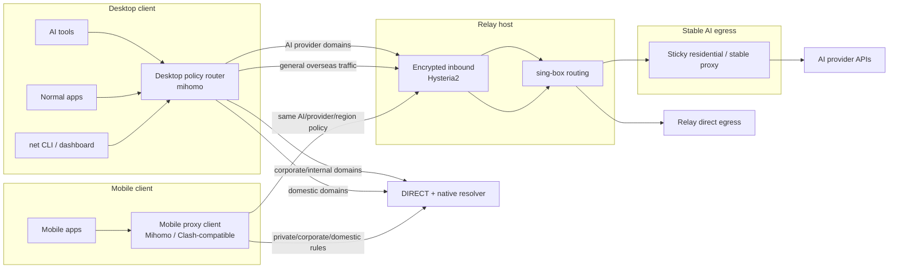

# AgentRouteKit

[中文文档](README.zh-CN.md)

Stop letting Claude Code and AI-agent traffic break your work network.

If you use Claude Code, Claude, Codex-style agents, or other AI coding tools from mainland China or another restricted network, the pain is usually not "how do I turn on a proxy". The real problem is that AI traffic, work traffic, subprocesses, and provider risk all get mixed together.

AgentRouteKit is built for that exact failure mode:

- Claude Code / Claude access from mainland China can fail, leak to the wrong route, or trigger provider risk controls, including account enforcement or ban risk.
- Codex-style agents amplify network mistakes because they spawn shells, package managers, Git, test runners, and browser tools that inherit broken proxy state.
- AI sessions fail because the egress IP changes, leaks, or falls back to a bad route.
- A global proxy makes office apps, internal domains, IDEs, CLIs, package managers, or databases behave unpredictably.
- Shell-level `HTTP_PROXY` fixes one tool but pollutes every child process.
- VM + VPN isolation works, but it is heavy, hard to reuse, and awkward to operate every day.
- The setup is spread across proxy configs, relay configs, scripts, notes, and manual runbooks, so another AI agent cannot reproduce it safely.

AgentRouteKit turns that mess into an agent-deployable network control plane. A human fills one input file; an AI agent renders configs, installs the local router, deploys the relay, switches modes, and validates the result.

## What It Solves

| Pain | What AgentRouteKit Does |
|---|---|
| Claude Code / Claude traffic needs a stable, low-risk egress | Pins AI provider domains to a stable egress route |
| Codex-style agents leak proxy state into child processes | Keeps routing policy in the network layer instead of ad hoc shell exports |
| Work traffic must not go through the AI route | Sends corporate/internal, domestic, and private traffic direct |
| VPN/proxy changes are hard to debug | Provides `net`, `diagnose`, smoke tests, and a local dashboard |
| Manual setup is easy to get wrong | Uses an explicit `agent-input.env` contract and rendered templates |
| Public examples often leak secrets | Keeps credentials and generated configs outside the repository |

## What It Does Not Solve

This is a network routing and operations project. It does not guarantee account safety, device-fingerprint isolation, browser-profile cleanliness, or compliance with any AI provider policy. If your main risk is account/device hygiene, pair this with a VM, dedicated browser profile, or other isolation strategy.

## What It Builds



## Mobile Clients

The mobile version uses the same routing policy model as the desktop version: classify domains first, then choose direct, relay, or stable AI egress. The current automation scripts install the desktop macOS router; mobile devices import an equivalent Mihomo/Clash-style profile or copy the same rule blocks into a compatible app.

- iOS/iPadOS: [Shadowrocket](https://apps.apple.com/us/app/shadowrocket/id932747118) and [Stash](https://stash.ws/) are common rule-based clients. Buy/download through the official App Store path for your region and avoid shared Apple IDs, cracked builds, or enterprise-signed packages.
- Android: [FlClash](https://github.com/chen08209/FlClash) is an open-source Mihomo/ClashMeta-style client. Check the [Hysteria 2 third-party app list](https://v2.hysteria.network/docs/getting-started/3rd-party-apps/) when you need current protocol support across apps.
- Reusable rules: start from [policy/routing-demo.yaml](policy/routing-demo.yaml), keep real corporate/internal suffixes private, and replace only the placeholder domains and proxy group names.

More detail is in [docs/mobile-clients.md](docs/mobile-clients.md). For maintained public domain sets, see the [Mihomo rule-provider docs](https://wiki.metacubex.one/en/config/rule-providers/), [MetaCubeX/meta-rules-dat](https://github.com/MetaCubeX/meta-rules-dat), [Loyalsoldier/clash-rules](https://github.com/Loyalsoldier/clash-rules), and [blackmatrix7/ios_rule_script](https://github.com/blackmatrix7/ios_rule_script).

## Product Principles

- **Pain first**: this project exists to keep AI traffic stable without damaging normal work traffic.
- **Policy before proxy**: classify traffic first, then choose transport.
- **Stable AI route**: pin Claude Code, Claude, and other AI provider domains to a stable egress.
- **Work traffic stays local**: corporate/internal, domestic, and private traffic are explicit direct routes.
- **Agent deployable**: humans provide facts; agents render, install, deploy, and verify.
- **Operations are part of the product**: switching, diagnostics, logs, and monitoring are first-class.

## Quick Start for an AI Agent

1. Copy the input contract:

   ```bash
   cp agent-input.example.env agent-input.env
   ```

2. Ask the human to fill only `agent-input.env`.

3. Check prerequisites and render deployable configs:

   ```bash
   bash scripts/check-prereqs.sh agent-input.env
   python3 tools/render-config.py --env agent-input.env --out build
   ```

4. Install the local config and deploy the relay:

   ```bash
   bash scripts/install-local-macos.sh build
   bash scripts/deploy-relay.sh build
   ```

5. Enable and validate:

   ```bash
   bash tools/net on
   bash tools/net status
   bash tools/diagnose
   make smoke
   ```

See [docs/AGENT_DEPLOYMENT.md](docs/AGENT_DEPLOYMENT.md) for the exact autonomous deployment contract. Agents should also follow [AGENTS.md](AGENTS.md) and the machine-readable [agent-manifest.json](agent-manifest.json).

## Human Input Surface

The human should only need to provide:

- Relay SSH target and OS assumptions.
- Stable AI egress proxy endpoint and credentials.
- Hysteria2 password/SNI/port.
- Local network service name and local proxy ports.
- AI provider domain list.
- Corporate/internal domain suffixes, if any.
- Domestic/direct domain suffixes, if any.

Everything else is generated from templates.

## My Current Reference Setup

AgentRouteKit is provider-neutral. Any relay host, Hysteria2-compatible setup, and stable HTTP egress proxy can work if they match the input contract. The reference setup behind this repository is intentionally small: one Singapore relay VPS plus one Singapore stable egress IP for AI traffic.

I picked Singapore because the AI egress IP is also in Singapore, so relay-to-egress latency stays low. For Claude Code and agent workflows, stable identity matters more than maximizing general browsing speed. A Hong Kong or CN-optimized route may be faster for normal browsing, but it is usually more expensive and not necessary for this specific AI egress problem.

| Role | My Practice | Why This Is Enough | Cost Signal | Link |
|---|---|---|---|---|
| Stable AI egress proxy | Singapore static residential / ISP HTTP proxy, dedicated or premium tier | One sticky IP is enough for Claude/Anthropic domains; HTTP/SOCKS5 support and roughly 100 concurrent connections are already plenty for personal agent use | My target Proxy-Cheap class is the static residential ISP dedicated/premium tier, about `$3.6/month` | [Proxy-Cheap](https://app.proxy-cheap.com/r/MyxSfH) |
| Relay VPS | Singapore VPS running Hysteria2 + sing-box | The relay only terminates the encrypted tunnel and applies routing policy; 1 vCPU / 1 GB RAM / 25 GB disk / about 1 TB transfer is enough in my use | My current SG VPS class is about `$5/month` | [Vultr](https://www.vultr.com/?ref=9910053) |

## Local Dashboard

```bash
python3 dashboard/server.py
```

Open `http://127.0.0.1:8765` to inspect status, run diagnostics, and switch modes through a local-only UI.

## Repository Layout

```text
.
├── AGENTS.md
├── README.md
├── README.zh-CN.md
├── agent-manifest.json
├── agent-input.example.env
├── configs/
│   ├── claude-code/settings.template.json
│   ├── mihomo/config.template.yaml
│   └── sing-box/relay.template.json
├── dashboard/
│   ├── index.html
│   ├── README.md
│   └── server.py
├── docs/
│   ├── AGENT_DEPLOYMENT.md
│   ├── architecture.md
│   ├── mobile-clients.md
│   ├── operations-dashboard.md
│   ├── policy-model.md
│   └── security-and-privacy.md
├── policy/
│   ├── ai-providers.yaml
│   ├── corporate.example.yaml
│   ├── domestic.example.yaml
│   └── routing-demo.yaml
├── scripts/
│   ├── check-prereqs.sh
│   ├── deploy-relay.sh
│   └── install-local-macos.sh
├── tests/
│   └── smoke.sh
└── tools/
    ├── diagnose
    ├── net
    └── render-config.py
```

## Verification

Before publishing or after changing templates:

```bash
make smoke
```

The smoke test renders configs from the example input, validates JSON, checks script syntax, compiles the Python entrypoints, exercises the local dashboard, and scans the public tree for generic secret/privacy markers.
