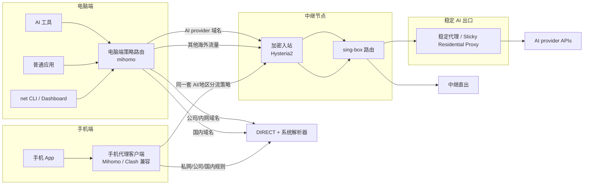

# AgentRouteKit

[English README](README.md)

别再让 Claude Code 和 AI agent 的网络问题拖垮你的工作环境。

如果你在中国大陆或类似受限网络里使用 Claude Code、Claude、Codex 风格的 agent 或其它 AI 编程工具，真正的问题通常不是“怎么开代理”，而是 AI 流量、工作流量、子进程和账号风控被混在了一起。

AgentRouteKit 针对的就是这类痛点：

- 中国大陆访问 Claude Code / Claude 时，出口漂移、线路泄漏或代理回落可能触发服务商风控，严重时带来账号限制甚至封号风险。
- Codex 风格的 agent 会进一步放大网络问题，因为它会启动 shell、包管理器、Git、测试进程和浏览器工具，这些子进程很容易继承错误代理环境。
- AI 服务因为出口 IP 漂移、泄漏、掉回错误线路而不稳定。
- 全局代理能救 AI 工具，却把办公应用、内网域名、IDE、CLI、包管理器或数据库连接弄坏。
- 在 shell 里设置 `HTTP_PROXY` 只解决了一个工具，却污染了所有子进程。
- 虚拟机 + VPN 的隔离方案能用，但太重、复用困难，日常操作成本高。
- 配置散落在代理配置、中继配置、脚本、笔记和手工 runbook 里，另一个 AI agent 很难安全复现。

AgentRouteKit 把这些零散经验收敛成一个可部署的网络控制平面：人只填写一份输入文件，AI agent 负责渲染配置、安装本地路由器、部署中继、切换模式并验证结果。

## 它解决什么

| 痛点 | AgentRouteKit 的处理方式 |
|---|---|
| Claude Code / Claude 流量需要稳定、低风险出口 | 将 AI provider 域名固定到稳定出口 |
| Codex 风格 agent 会把代理状态泄漏给子进程 | 把路由策略放在网络层，而不是依赖零散的 shell export |
| 工作流量不能被 AI 线路污染 | 公司/内网、国内域名、私网网段显式直连 |
| VPN/代理切换后很难定位问题 | 内置 `net`、`diagnose`、smoke test 和本地 Dashboard |
| 手工部署容易漏步骤 | 用 `agent-input.env` 作为输入契约，自动渲染模板 |
| 公开示例容易泄漏秘密 | 凭据和生成配置默认不进仓库 |

## 它不解决什么

AgentRouteKit 解决的是网络路由、稳定出口、诊断和运维问题。它不保证解决账号风控、设备指纹、浏览器残留、登录环境污染或服务商策略风险。

如果你的主要风险来自账号或设备环境，应把本项目和虚拟机、独立浏览器 Profile 或其它隔离方案配合使用。

## 架构概览



核心思想是先分类，再传输：

1. AI provider 域名走稳定 AI 出口。
2. 公司内网、内部 CDN、国内域名和私网 IP 直连。
3. 其他未命中的流量按当前模式处理。
4. 切换、诊断、重启和验证都通过固定命令完成，便于人和 agent 共用。

## 手机端方案

手机端复用同一套路由策略：先按域名和网段分类，再决定直连、中继或稳定 AI 出口。当前仓库的自动安装脚本主要覆盖电脑端 macOS；手机端通常是把等价的 Mihomo/Clash 配置或规则片段导入到支持的客户端里。

- iOS/iPadOS：可以看 [Shadowrocket / 小火箭](https://apps.apple.com/us/app/shadowrocket/id932747118) 或 [Stash](https://stash.ws/) 这类规则型客户端。购买和下载建议走官方 App Store 路径；不要使用共享 Apple ID、破解版或企业签名包。
- Android：可以看 [FlClash](https://github.com/chen08209/FlClash) 这类开源 Mihomo/ClashMeta 客户端。不同客户端对 Hysteria2、rule-provider、MRS 规则集的支持会变化，选型前可以先看 [Hysteria 2 第三方应用列表](https://v2.hysteria.network/zh/docs/getting-started/3rd-party-apps/)。
- 路由规则 Demo：见 [policy/routing-demo.yaml](policy/routing-demo.yaml)。里面用 `corp.example`、`internal.example` 等占位符替代真实内网域名，公开提交前不要写入公司或个人内网后缀。

更详细的手机端导入方式和检查清单见 [docs/mobile-clients.md](docs/mobile-clients.md)。通用域名规则可以参考 [Mihomo rule-provider 文档](https://wiki.metacubex.one/en/config/rule-providers/)、[MetaCubeX/meta-rules-dat](https://github.com/MetaCubeX/meta-rules-dat)、[Loyalsoldier/clash-rules](https://github.com/Loyalsoldier/clash-rules) 和 [blackmatrix7/ios_rule_script](https://github.com/blackmatrix7/ios_rule_script)，按客户端支持的格式自行选择。

## 人需要提供什么

复制输入模板：

```bash
cp agent-input.example.env agent-input.env
```

然后只填写 `agent-input.env`。通常需要提供：

- 中继服务器 SSH 地址。
- 本地代理端口和 mihomo API 端口。
- Hysteria2 密码、SNI、端口。
- 稳定 AI 出口的 HTTP 代理地址和凭据。
- AI provider 域名列表。
- 公司/内网域名后缀，若需要。
- 国内或必须直连的域名后缀，若需要。

不要修改模板文件；模板由渲染脚本消费。

## AI Agent 部署流程

Agent 应按以下顺序执行：

```bash
bash scripts/check-prereqs.sh agent-input.env
python3 tools/render-config.py --env agent-input.env --out build
bash scripts/install-local-macos.sh build
bash scripts/deploy-relay.sh build
bash tools/net on
bash tools/net status
bash tools/diagnose
make smoke
```

对应职责：

- `check-prereqs.sh`：检查依赖、输入文件和 SSH 连通性。
- `render-config.py`：生成 mihomo、sing-box 和 AI 工具配置。
- `install-local-macos.sh`：安装本地 mihomo 配置和 launchd 服务。
- `deploy-relay.sh`：上传 sing-box 配置、生成证书、重启远端服务。
- `tools/net`：切换模式和查看状态。
- `tools/diagnose`：分层诊断本地代理、AI 路由、公司 DNS 和探测 URL。
- `make smoke`：发布前自检。

详细契约见：

- [AGENTS.md](AGENTS.md)
- [agent-manifest.json](agent-manifest.json)
- [docs/AGENT_DEPLOYMENT.md](docs/AGENT_DEPLOYMENT.md)

## 我的实际服务选择

AgentRouteKit 不绑定任何服务商。只要符合输入契约，任意中继 VPS、Hysteria2 兼容部署方式、稳定 HTTP 出口代理都可以使用。

我自己的实践很小：一台新加坡 VPS 做中继，一条新加坡稳定出口 IP 专门给 Claude / Anthropic / AI provider 流量使用。

选择 SG 的原因：

- 稳定 AI 出口本身在 SG，中继 VPS 也放 SG，VPS 到出口代理的延迟很低。
- Claude Code 和 agent 工作流更需要稳定出口身份，而不是极致的通用网页速度。
- HK / CN2 / 优化线路通常更贵；如果只是解决 AI 出口稳定性，当前不一定值得。
- VPS 只跑 Hysteria2 + sing-box 分流，不跑重服务，低配已经够用。

| 角色 | 我的实践 | 为什么够用 | 费用体感 | 链接 |
|---|---|---|---|---|
| 稳定 AI 出口代理 | SG static residential / ISP HTTP proxy，静态住宅 ISP 专用版或高级版 | 1 个固定出口 IP 足够承载 Claude/Anthropic 域名；HTTP/SOCKS5 和约 100 并发级别对个人 agent 使用已经够用 | 我当前目标规格是 Proxy-Cheap 静态住宅 ISP 专用版/高级版，预计约 `$3.6/月` | [Proxy-Cheap](https://app.proxy-cheap.com/r/MyxSfH) |
| 中继 VPS | SG VPS，运行 Hysteria2 + sing-box | 中继只负责加密入站和分流；我的使用里 1 vCPU / 1GB RAM / 25GB SSD / 约 1TB 流量已经够用 | 当前这类 SG VPS 大约 `$5/月` | [Vultr](https://www.vultr.com/?ref=9910053) |

## 常用命令

```bash
# 渲染配置
python3 tools/render-config.py --env agent-input.env --out build

# 启用默认模式
bash tools/net on

# 仅 AI 工具走显式代理，其它系统流量不接管
bash tools/net ai-only

# 应急直连
bash tools/net bypass

# 查看状态
bash tools/net status

# 诊断
bash tools/diagnose

# 发布前自检
make smoke
```

## 本地 Dashboard

启动：

```bash
python3 dashboard/server.py
```

打开：

```text
http://127.0.0.1:8765
```

Dashboard 只绑定本地地址，并且只暴露白名单动作：

- Status
- Diagnose
- On
- AI Only
- Bypass

CLI 仍然是自动化部署和运维的主接口；Dashboard 只是便捷控制面。

## 目录结构

```text
.
├── AGENTS.md                       # Agent 操作规则
├── README.md                       # 英文 README
├── README.zh-CN.md                 # 中文 README
├── agent-input.example.env         # 人需要填写的信息模板
├── agent-manifest.json             # 机器可读部署契约
├── configs/                        # 配置模板
├── dashboard/                      # 本地 Dashboard MVP
├── docs/                           # 架构、部署、策略、安全文档
├── policy/                         # 策略示例
├── scripts/                        # 部署脚本
├── tests/                          # smoke test
└── tools/                          # 渲染、切换、诊断工具
```
