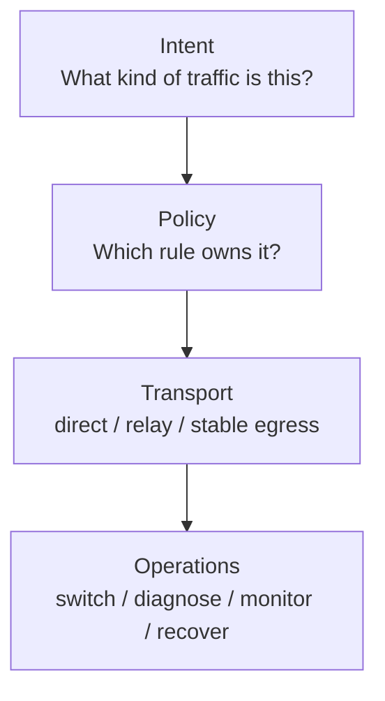
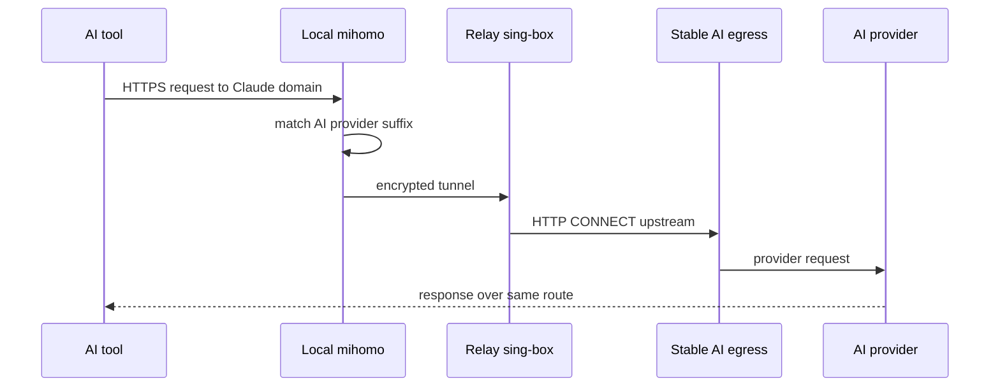
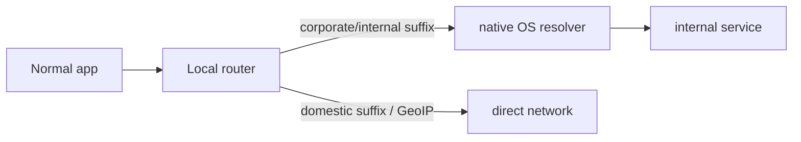
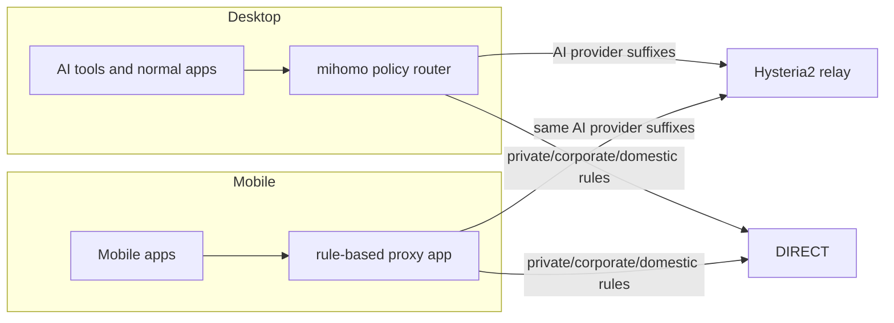

# Architecture

AgentRouteKit separates classification, transport, and operations.

## Layers

## Runtime

Corporate/internal and domestic traffic should not touch the stable AI egress.

## Client Surfaces

Desktop and mobile clients use the same policy order. The desktop path is automated by this repository's macOS scripts. The mobile path is profile/rule reuse through a compatible client.

Mobile clients should import an equivalent Mihomo/Clash-style profile and keep the same rule order:

1. Loopback, private IP ranges, and redacted corporate/internal suffixes go `DIRECT`.
2. AI provider suffixes go to the stable AI route.
3. Domestic/direct suffixes and CN GeoIP go `DIRECT`.
4. General overseas or unmatched traffic follows the selected proxy group.

See [mobile-clients.md](mobile-clients.md) and [../policy/routing-demo.yaml](../policy/routing-demo.yaml) for a copyable starting point.

## Why a Relay Exists

The relay keeps the client-to-relay path encrypted and gives the project one central place to:

- Forward Claude domains to stable egress.
- Let general overseas traffic use relay direct egress.
- Rotate stable egress providers without changing client policy.
- Add server-side health checks and fallback later.
