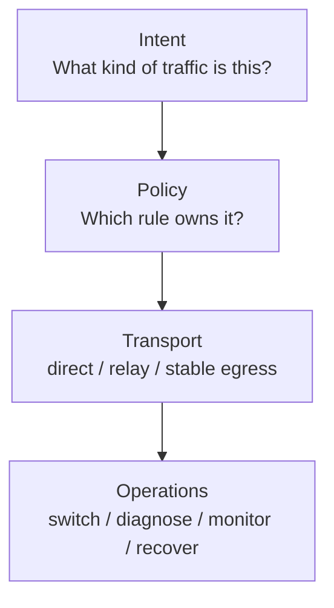
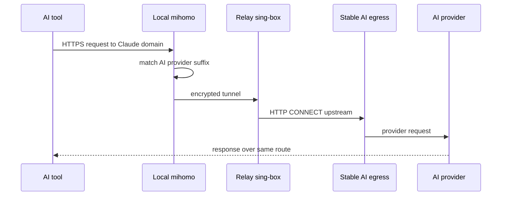
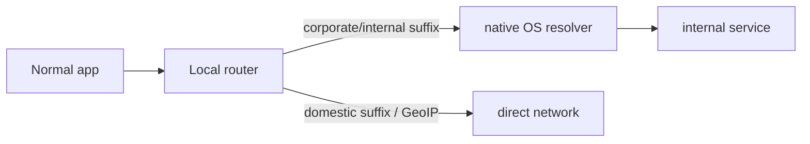

# Architecture

AgentRouteKit separates classification, transport, and operations.

## Layers

## Runtime

Corporate/internal and domestic traffic should not touch the stable AI egress.

## Why a Relay Exists

The relay keeps the client-to-relay path encrypted and gives the project one central place to:

- Forward Claude domains to stable egress.
- Let general overseas traffic use relay direct egress.
- Rotate stable egress providers without changing client policy.
- Add server-side health checks and fallback later.
