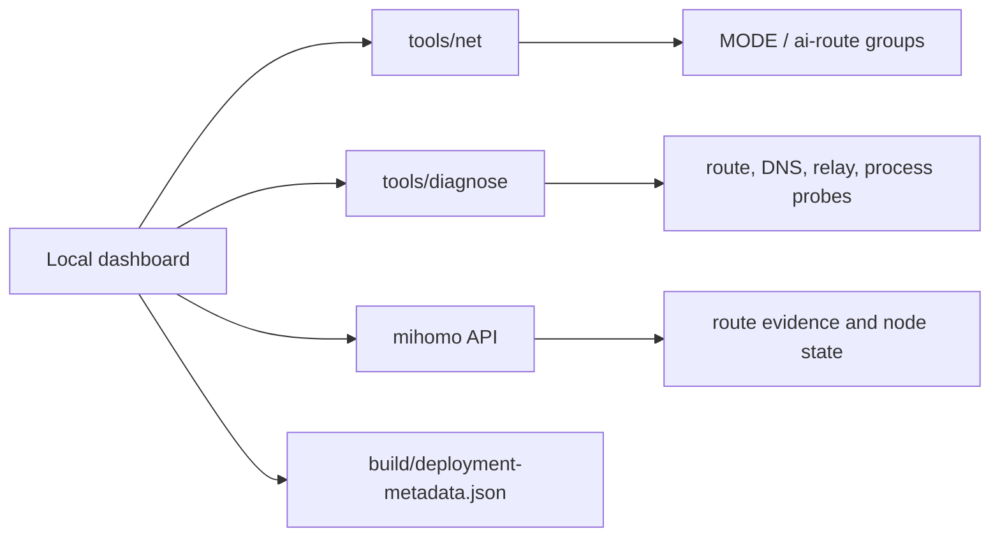

# Operations Dashboard

The dashboard is a local control plane over the generated config, local router API, and deployment scripts.

It can start as a thin UI over `tools/net` and `tools/diagnose`; the product should keep the same command contracts so both humans and AI agents can operate it.

## Control Model



## Required Controls

| Control | Command/API | Expected Result |
|---|---|---|
| On | `tools/net on` | system HTTP/HTTPS proxy on, `MODE=Global`, `ai-route=ai-relay` |
| AI Only | `tools/net ai-only` | system proxy off, AI route stays on relay |
| Bypass | `tools/net bypass` | system proxy off, AI route set to direct |
| Status | `tools/net status` | mode, AI route, router process, local proxy port |
| Diagnose | `tools/diagnose` | layered health report |
| Reload Config | local router reload command | rendered config becomes active |
| Deploy Relay | `scripts/deploy-relay.sh build` | remote sing-box service active |
| Check Prereqs | `scripts/check-prereqs.sh agent-input.env` | missing input/dependencies surfaced |

## MVP Implementation

The repository includes a zero-dependency MVP:

```bash
python3 dashboard/server.py
```

It serves `dashboard/index.html` on `127.0.0.1:8765` and exposes only whitelisted endpoints:

- `POST /api/status`
- `POST /api/diagnose`
- `POST /api/on`
- `POST /api/ai-only`
- `POST /api/bypass`

## Panels

### Profile

- Active mode.
- AI route target.
- System proxy state.
- Local proxy/API ports.

### Claude Route

- Configured Claude domains.
- Relay node health.
- Stable AI egress health.
- Last route-match evidence.

### Corporate/Internal

- Configured corporate suffix count.
- Native resolver probe result.
- Direct route confirmation.
- Warning if corporate suffixes are empty but corporate probes are configured.

### Relay

- SSH target.
- sing-box service status.
- Hysteria2 port/SNI.
- Recent restart result.

### Alerts

- Router API unreachable.
- Local process down.
- AI route set to direct outside bypass mode.
- System SOCKS proxy enabled.
- Corporate DNS resolution failure.
- Relay service inactive.

## Safety Rules

- The dashboard must not display raw proxy passwords.
- The dashboard must not write `agent-input.env`.
- Remote deployment actions should show the target host and config path before execution.
- Logs must be bounded and redact URLs with credentials.
- Bypass mode must be visually distinct because it disables the stable AI egress route.
