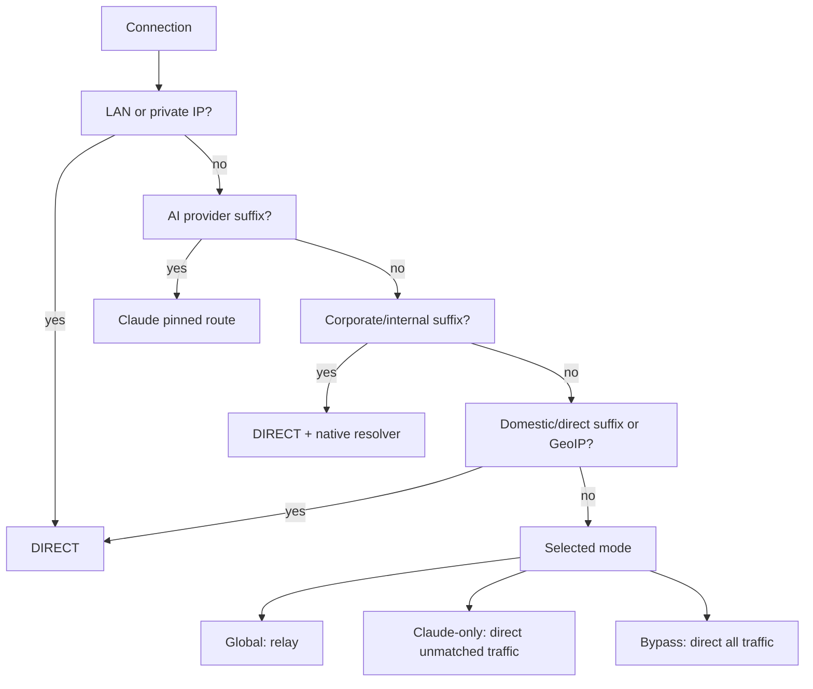

# Policy Model

Policy is evaluated from most specific and safest to broadest.



## Rule Packs

- `policy/ai-providers.yaml`: domains that require stable AI egress.
- `policy/corporate.example.yaml`: example structure for company/internal domains.
- `policy/domestic.example.yaml`: domains that should stay local/direct.

## Corporate/Internal Domains

Treat company and internal CDN domains as explicit first-class routes:

1. Route them `DIRECT`.
2. Resolve them through the OS resolver when VPN/MDM hooks DNS.
3. Add probes for critical suffixes.
4. Keep the real suffix list private if it identifies internal infrastructure.

The generic template is:

```yaml
nameserver-policy:
  "+.corp.example": system

rules:
  - DOMAIN-SUFFIX,corp.example,DIRECT
```
