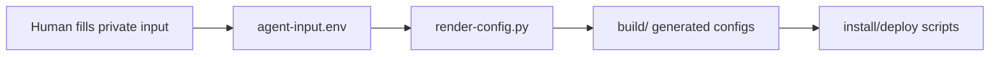

# Security and Privacy

## Do Not Commit

- Relay SSH credentials.
- Stable AI egress proxy credentials.
- Generated configs in `build/`.
- QR codes or mobile profiles with embedded secrets.
- Company/internal domain lists if they reveal private infrastructure.
- Logs containing request domains, IPs, or account identifiers.

## Secret Flow

Only templates are public. `agent-input.env` and `build/` are local artifacts.

## Operational Boundaries

- The dashboard and CLI should talk only to local APIs by default.
- Destructive actions, such as replacing remote relay config, should have `--dry-run` or a clear generated diff in production implementations.
- Diagnostics must redact proxy auth strings and avoid dumping full logs.
- Network stability does not replace account or device isolation.
